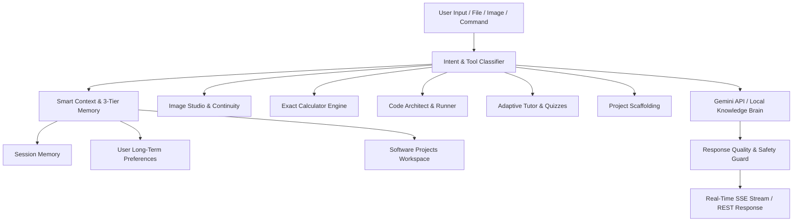

# 🤖 Nexus AI — Personal AI Assistant & Software Platform

A modern, full-stack, multimodal Personal AI Assistant and software workspace built with React 18, TailwindCSS, Node.js, SQLite with WAL mode, and Google Gemini.

---

## ✨ Platform Highlights & Key Capabilities

- **🧠 Multi-Tier AI Memory System**:
  - **Session Memory**: In-flight multi-turn context and pronoun resolution.
  - **Long-Term User Memory**: Persistent preferences, tech stack, and goals (`memories` table).
  - **User Memory Controls**: Save (`/memory`), recall (`/memories`), forget (`/forget`), and dedicated AI Memory Management modal.
- **🛠️ High-Priority Intent & Tool Routing**:
  - **Multimodal Image Studio & Gallery**: Structured generation (1:1, 16:9, 9:16, 4:3), styles, lighting, and conversational multi-turn iteration (`server/tools/imageGen.js`).
  - **Software Projects Workspace**: Natural language project scaffolding (Tech Stack, Folder Tree, SQLite/Postgres schemas, API endpoints, and task checklist).
  - **Interactive Learning Tutor & Quizzes**: Adaptive curriculum (Python Core, JavaScript, System Design), real-time quizzes, scoring, and topic mastery tracking.
  - **Calculator Engine**: Exact arithmetic, percentages, temperature (°C to °F), and unit conversions.
  - **Code Architect & Bug Fixing**: Automatic code analysis, problem identification, and verified solutions.
- **🎨 4 Theme Presets & Command Palette**:
  - **Themes**: **Midnight Dark** (default), **Clean Light**, **Aurora Glass**, and **AMOLED Black**.
  - **6 Custom Accent Colors**: Lavender Neon, Cyberpunk Sky, Emerald Matrix, Sunset Rose, Amber Gold, and Neon Pink.
  - **Global Command Palette (`Ctrl/Cmd + K`)**: Instant search across chats, tools, workspaces, and settings.
- **🔐 Secure User Authentication & Isolation**:
  - Sign up, Log in, and 1-Click Guest Demo mode.
  - Passwords hashed with `bcryptjs` (salt factor 10).
  - JWT authorization verifying user ownership on every database query.
- **🤖 Automated AI Testing System**:
  - Run `npm run test:ai` to automatically validate 54 behavioral test cases across intent matrix, tool execution, safety, and memory.

---

## 🏗️ Architecture Overview



---

## 🚀 Quick Start Guide

### 1. Prerequisites
- **Node.js** (v18 or higher recommended)
- **npm** (v9 or higher)
- **Git**

### 2. Clone the Repository
```bash
git clone https://github.com/your-username/your-repo-name.git
cd your-repo-name
```

### 3. Install Dependencies
```bash
npm run install:all
```

### 4. Configure Environment Variables
Create a `.env` file in the `server/` directory (or copy `server/.env.example`):
```env
PORT=5000
JWT_SECRET=your_jwt_secret_key_here
GEMINI_API_KEY=your_gemini_api_key_here
DEFAULT_AI_MODEL=gemini-1.5-flash
```

> **Note**: If you don't have a Gemini API key yet, the application includes a smart local knowledge engine covering coding, cybersecurity, system design, math, and project architecture out of the box! You can get a free Gemini API key from [Google AI Studio](https://aistudio.google.com/).

### 5. Run the Application
```bash
# Starts Backend (Port 5000) and Frontend (Port 5173) concurrently:
npm run dev
```

Open your browser at **`http://localhost:5173`** (or **`http://localhost:5000`** in production).

---

## 🧪 Automated Testing

Run the complete AI validation suite:
```bash
npm run test:ai
```

---

## 📄 License
MIT License. Free for personal and commercial use.
